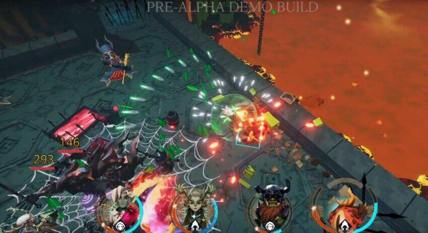
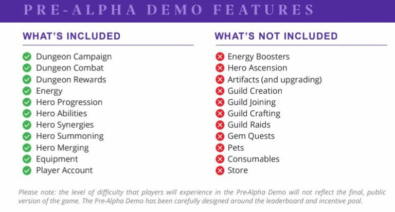

Guild of Guardians has begun selecting a lucky few to download and join in their closed alpha. Emails are arriving in inboxes with links to the download, a guide to playing the game, and a special code providing access to what is officially a ‘pre-alpha demo’.

<!--more-->

A year after selling their Founder NFTs, Guild of Guardians finally puts a long awaited, and much anticipated alpha built into player’s hands. And it looks fantastic! Starting right off the bat with a useful tutorial to introduce new players to the game basics, this build is very polished, and does not feel like an alpha!

## Pre-Alpha Gameplay

Guild of Guardians is basically a party-based Diablo or Lost Relics. Journey through dungeons with a overhead, 3rd party view, fight monsters, gain levels and loot. At the end of the dungeon, exit to receive experience and equip your new loot.

Players begin with 240 Energy and use 10 when entering dungeons. Energy is refilled to maximum at the start of each day. There are two worlds available for this alpha, Crypt and Magma. Each has twelve dungeons. As you might imagine, they get progressively harder and you must defeat the current open dungeon before you can move to the next. Each dungeon also comes with a suggested power rating for your party.

This pre-alpha features a leaderboard. Score is based on the number of dungeons completed, the amount of experience gained, heroes leveled, and a surprise category that the team will reveal at the end of the alpha. Players on the leaderboard receive GoG tokens as rewards.

The alpha only offers single player gameplay at the moment. It also runs off-chain and though it does offer prizes, does not feature any of the planned play to earn mechanics.

## Thoughts on the Pre-Alpha Experience?

I’ve played the ‘pre-alpha demo build’ for about 30 minutes, and I have been thoroughly impressed. This is a very polished alpha and worth the long wait. Though the game is somewhat basic at the moment, it has those basics down and ready to go. The graphics look great, the game runs smoothly, the interface works well. There is an equipment and leveling up system, hero abilities, and hero summoning, just to name a few active features.

I really have no complaints aside from the fact that my old eyes have trouble seeing the details on my phone screen. I would play this game all the time on my PC!

Anyway, if you applied to get into the alpha, check your emails. Alpha access lasts through April 6th. Below is a graphic showing the full list of what features to expect and which ones are not yet available.

