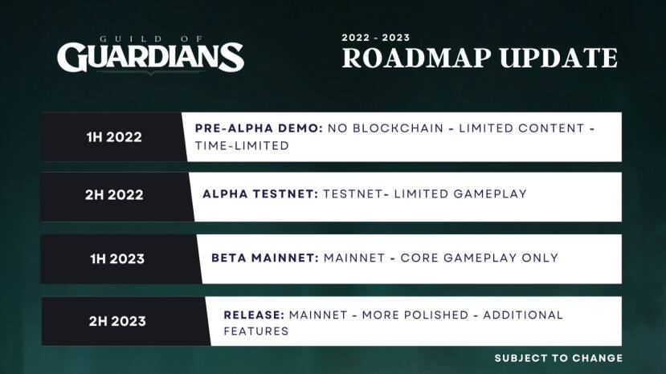

As the Guild Of Guardians first alpha is about to be released, we sat down and talked with Ryan Tadveen, community manager for Guild Of Guardians. We discuss the upcoming alpha release, the game’s economy and the vision that the team has for their game.

<!--more-->

We know that a lot of you are eager to be able to play the upcoming alpha release of Guild of Guardians, the upcoming mobile action RPG. The first playable alpha demo will be released very soon and available to GOG Founders NFT holders. We thought that it was a good time to touch base with the team and talk about their upcoming roadmap, the game’s economy and their overall vision. We also discuss the play and earn model which the GOG team was the first one to introduce and which has now become a popular narrative in the space.



Are you excited for the Guild of Guardians release? Let us know what you think in the Youtube comments. If you like our content, make sure to like the video and subscribe to our channel to get all our latest play-to-earn and NFT game reviews and interviews directly in your YouTube feed.

## What is Guild of Guardians?

Guild of Guardians is a cooperative, fantasy, action, dungeon crawler game, currently in development and powered by Immutable X. Players gather in groups of four to enter dungeons, battle through monsters, defeat dangerous bosses, and walk away with experience and treasure. The game uses NFTs for all of its heroes, items, and pets.

Guild of Guardians is taking a mobile first approach for their game. Guild of Guardians has already had a couple of rounds of NFT releases and also launched their token, GOG. The NFTs can be traded on Immutable X, and the token (GOG) can be found on all the ETH DEXs.

Guild of Guardians roadmap