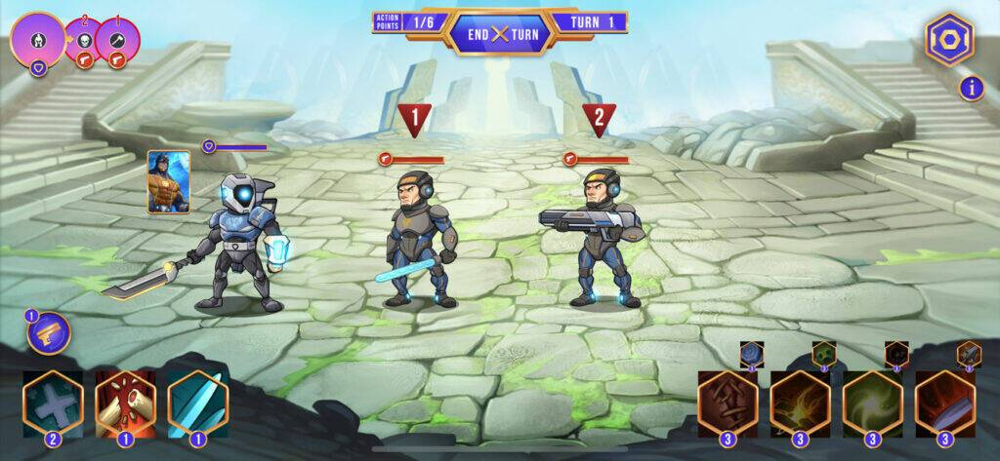
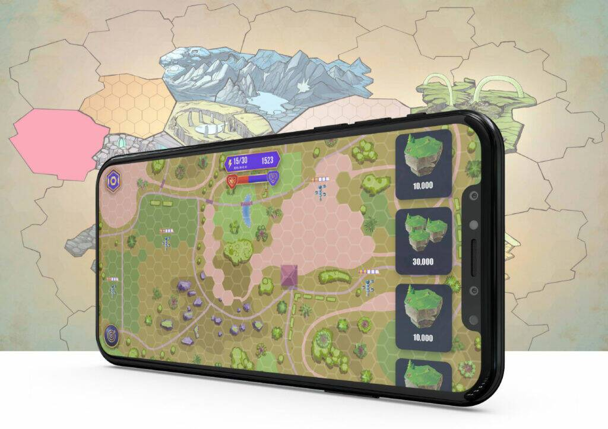
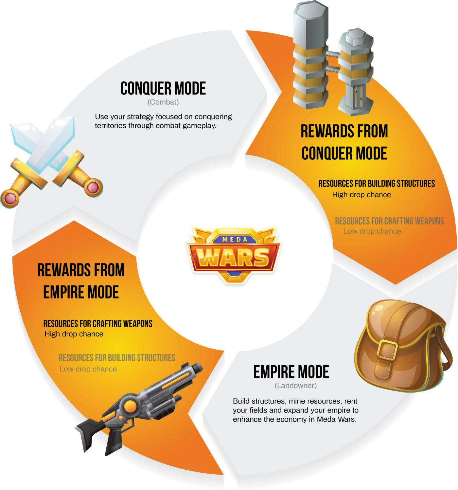

MedaWars is an ambitious new game built on top of a sci-fi metaverse, featuring both empire mode, for land play, and conquer mode, for PvE and PvP battles. Meda Wars is part of Cryptomeda – gaming ecosystem that uniquely blends NFT collectibles, DEFI mechanics, and iconic crypto characters into an exciting sci-fi world.

<!--more-->

The team at CryptoMeda doesn’t sleep on opportunities and is rushing through their roadmap for early 2022 announcing cross-game partnerships, new staking, and farming solutions in their staking platform, land sales and a demo release for MedaWars combat game play.

MedaWars is not live yet but is planned for release in Q2 2022. In the meantime, players can enjoy a fun minigame, MedaShooter, already playable on this webpage. The game is built on Unity and increases the utilization for Cryptomeda NFTs, meaning that NFT characters and weapons in MedaWars have utility inside of MedaShooter as well.

## What is MedaWars?

MedaWars will be the flagship title for CryptoMeda. The game is a turn-based, strategy game where players of two factions, Goliath – the faction with the order and strict laws, and Renegade – the faction that doesn’t solve issues with petty politics, fight for dominance over the territory.

You can see a quick trailer for the game here:



CryptoMeda already started selling characters for the game in the marketplace, each with its own special abilities, and announced a partnership with other games and studios, for example with Polygon Studios and Cryptoblades, to build the biggest cross-game title on the market.

MedaWars will feature the in-game currency MedaGas, which can be earned by playing the game, and $TECH which is the utility token used in the marketplace and the staking platform. Players can use MedaGas to build structures and enhance the power of their lands in the game, while $TECH is used to purchase NFTs in the marketplace, for staking, farming, and to swap for MedaGas.

CryptoMeda allocated 21% of $TECH in 3 years for staking and farming rewards, and the current APY is around 40% for Staking and 130% for farming.

If you’re interested in staking, the team recorded a quick video to explain the process:



$TECH runs on the Polygon Network. Fees are minimal and paid in MATIC. If you’re interested in learning more about MedaWars, you can read the article here.

## Empire Mode in MedaWars

The combat mode of MedaWars is a quite common 2d battling system already available in most games, including P2E titles. In Empire mode you can buy, sell and rent lands, mine Resources and build structures.

MedaWars started selling lands on their marketplace. Prices will start from $140. From March 21, 6PM UTC until the 28th of March, 6PM UTC you also get a 30% discount on all purchases. The “Legendary” lands, the highest tier available for sale, go for $1,040 in discount price.

After March 28th, the land sale on the marketplace will close. More lands will be available for purchase from their partners at the full price.

Each player will need either a character, land, or both to participate in Empire Mode. By owning a land, players can earn passive income when other characters mine, fight or travel through the land. By owning a character, players can pay a fee to the landowner and operate in the plot even if they don’t own it.

Also, owning land in MedaWars pre-launch gives the owners a ticket to join the lottery draw for lands, characters, weapons, and resources, meaning they can get free NFTs to play in-game by owning even the smallest plot.

Lands in Empire Mode will be of fundamental importance, as they’re used to gather resources, store minerals, and employ workers. Resources gathered through land play can be used to forge weapons, which will then be used in Conquer mode to beat other players and conquer their territories to earn bounties. 

Imagine land play in MedaWars like a mini clash of clans. After you build your castle, it’s time to fight to conquer who’s around you. 

CryptoMeda didn’t forget to include burning facilities in the plots, and buildings are a big part of it. To maintain sustainability, buildings in lands will give advantages to the owners, but there are neutral buildings dispersed on the map too. 

Using a structure in a land owned by another player will give a fee to the landowner while using a neutral structure (and some of them can only be neutral) will burn $TECH.

Players can own multiple lands, and there are a total of 21500 lands and 39000 plots. To learn more about the distribution of such plots, refer to the land play whitepaper.

## In Conclusion

With a good funding round of $2.7mln secured in March 2021, and an attractive set of collaborations announced almost daily on their Twitter and Telegram, CryptoMeda seems like a solid and fast-growing player in the play to earn market. 

Although their only released title is a very simple shooter game, MedaShooter, their upcoming MedaWars includes some enticing new features that would disrupt the market by giving great utility to the token and providing an enjoyable game in the meantime.
