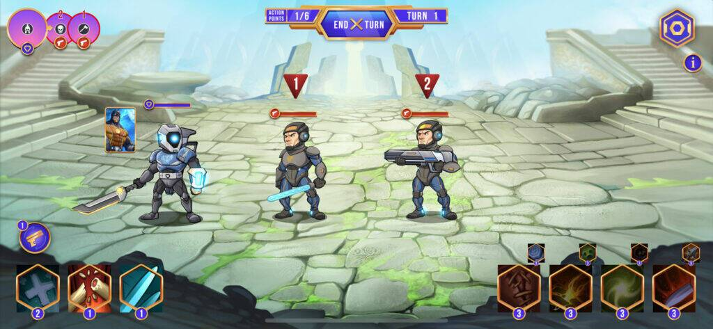
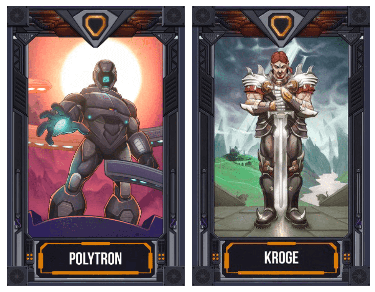
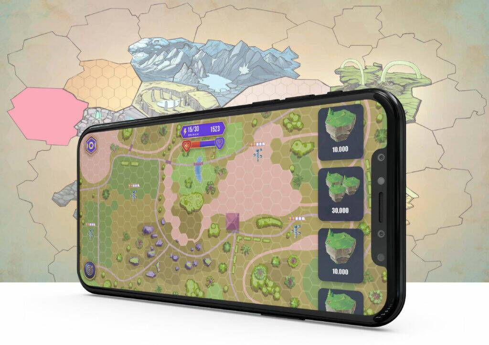
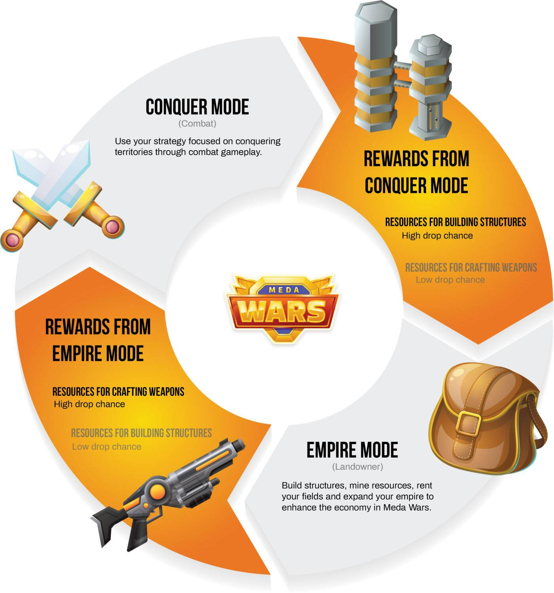
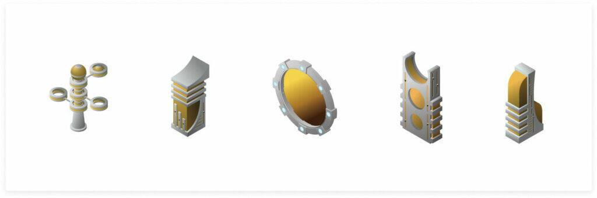

MedaWars 是一款雄心勃勃的新游戏，建立在科幻元宇宙之上，具有帝国模式（用于陆地游戏）和征服模式（用于 PvE 和 PvP 战斗）。Meda Wars 是 Cryptomeda 游戏生态系统的一部分，该生态系统将 NFT 收藏品、DEFI 机制和标志性加密角色独特地融合到令人兴奋的科幻世界中。

<!--more-->

[CryptoMeda](https://cryptomeda.tech/)的团队并没有抓住机会，而是匆忙制定 2022 年初的路线图，宣布在他们的 Staking 平台、土地销售和 MedaWars 战斗游戏演示中的跨游戏合作伙伴关系、新的 Staking 和农业解决方案。

[MedaWars](https://cryptomeda.tech/medawars)尚未上线，但计划于 2022 年第二季度发布。同时，玩家可以[在此网页上享受有趣的迷你游戏 MedaShooter](https://cryptomeda.tech/games/meda-shooter)。该游戏基于 Unity 构建，提高了 Cryptomeda NFT 的利用率，这意味着 MedaWars 中的 NFT 角色和武器也可以在 MedaShooter 中使用。

## 什么是 MedaWars？

MedaWars 将成为 CryptoMeda 的旗舰游戏。该游戏是一款回合制策略游戏，两个派系的玩家，Goliath - 有秩序和严格法律的派系，以及 Renegade - 不解决小政治问题的派系，为争夺领土的统治地位而战。

您可以在此处查看游戏的快速预告片：



CryptoMeda 已经开始[在市场上销售该游戏的角色](https://cryptomeda.tech/marketplace)，每个角色都有自己的特殊能力，并宣布与其他游戏和工作室（例如 Polygon Studios 和 Cryptoblades）建立合作伙伴关系，以打造市场上最大的跨游戏游戏。

MedaWars 将采用游戏内货币 MedaGas，可以通过玩游戏获得，以及 $TECH 是市场和 Staking 平台中使用的实用代币。玩家可以使用 MedaGas 在游戏中建造结构并增强其土地的力量，而 $TECH 用于在市场上购买 NFT，进行质押、耕作和交换 MedaGas。

[CryptoMeda 在 3 年内分配了 21% 的 $TECH 用于 Staking 和 Farming 奖励](https://cryptomeda.tech/staking)，目前的 APY 约为 Staking 的 40% 和 Farming 的 130%。

如果你对 Staking 感兴趣，团队录制了一段视频来解释这个过程：



$TECH 在多边形网络上运行。费用极低，并以 MATIC 支付。如果您有兴趣了解有关 MedaWars 的更多信息，可以[在此处阅读文章](https://cryptomedatech.medium.com/meda-wars-game-mode-breakdown-where-adventure-meets-combat-43f1223a45e7)。

## MedaWars 中的帝国模式

MedaWars 的战斗模式是一种相当常见的 2d 战斗系统，已在大多数游戏中提供，包括 P2E 游戏。在帝国模式中，您可以购买、出售和出租土地、开采资源和建造建筑。

MedaWars 开始[在他们的市场上出售土地](https://cryptomeda.tech/marketplace/lands)。价格从 140 美元起。从世界标准时间 3 月 21 日下午 6 点到世界标准时间 3 月 28 日下午 6 点，您还可以在所有购买时获得 30% 的折扣。“传奇”土地是可供出售的最高级别，折扣价为 1,040 美元。

3月28日之后，市场上的土地出售将关闭。更多的土地将可以从他们的合作伙伴处以全价购买。

每个玩家都需要一个角色、一个土地或两者都参与帝国模式。通过拥有土地，玩家可以在其他角色挖掘、战斗或穿越土地时获得被动收入。通过拥有一个角色，玩家可以向土地所有者支付费用并在情节中进行操作，即使他们不拥有它。

此外，在 MedaWars 预发布中拥有土地可为所有者提供参加土地、角色、武器和资源抽奖的门票，这意味着他们可以通过拥有最小的地块获得免费的 NFT 在游戏中玩。

帝国模式中的土地将至关重要，因为它们用于收集资源、储存矿产和雇用工人。通过陆地游戏收集的资源可用于锻造武器，然后在征服模式下用于击败其他玩家并征服他们的领土以获得赏金。 

想象一下 MedaWars 中的陆上游戏，就像一场小型部落冲突。建造城堡后，是时候为征服周围的人而战了。 

CryptoMeda 没有忘记在地块中包括燃烧设施，建筑物是其中的重要组成部分。为了保持可持续性，土地上的建筑物会给所有者带来优势，但地图上也有分散的中立建筑物。 

在其他玩家拥有的土地上使用结构将向土地所有者支付费用，而使用中立结构（其中一些只能是中立的）将消耗 $TECH。

玩家可以拥有多块土地，总共有21500块土地和39000块地块。要了解有关此类地块分布的更多信息，[请参阅土地游戏白皮书](https://cryptomeda.tech/docs/land_paper.pdf)。

## 综上所述

凭借在 2021 年 3 月获得的 270 万美元的良好[融资，以及几乎每天在其](https://crypto.news/nft-cryptomeda-raises-2-3-million-strategic-funding-round/)[Twitter](https://twitter.com/cryptomedatech)和[Telegram](https://t.me/Cryptomeda)上宣布的一系列有吸引力的合作，CryptoMeda 似乎是一个稳固且快速增长的参与者，以赢得市场。 

尽管他们唯一发布的游戏是一款非常简单的射击游戏 MedaShooter，但他们即将推出的 MedaWars 包含一些诱人的新功能，这些功能将通过为代币提供强大的实用性并同时提供令人愉快的游戏来扰乱市场。