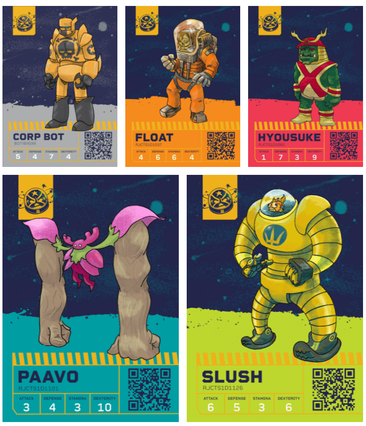

独立开发商 Boss Cannon 今天宣布与 Polygon Studios 建立合作伙伴关系，以解决 NFT 对他们全新的竞技场纸牌对战游戏 Wrejects 的环境影响。这种合作伙伴关系还将允许用户以最低的汽油费铸造和交易 NFT。

<!--more-->

3 月 31 日，通过 OpenSea Marketplace 和Wrejects.com，Wrejects Series 1 NFT 系列将在 Polygon 区块链上发布。选择 Polygon 而不是 Ethereum 将允许进行廉价和节能的 NFT 交易。使用 Polygon 的 NFT 铸造将产生不到其目前在标准以太坊区块链上产生的碳排放量的 1%。

> “随着汽油费的降低，我们希望通过我们负担得起的 NFT 收藏品让我们的客户更容易购> 买。我们讨厌人们支付比实际物品更多的汽油费，而 Polygon 允许我们这样做，”
>
> Casey Copeland，Wrejects 首席执行官

即将推出的 Wrejects Series 1 NFT 合集预览

> “很高兴看到更多 NFT 项目开始在 Polygon 上推出他们的系列。他们不仅通过减少碳> 排放来帮助改变现状，而且还通过降低费用和更快的交易使他们的买家受益。Wrejects > 选择 Polygon 作为他们的收藏品绝对是一个明智的决定。”
>
> Polygon Studios 的参谋长 Ishan Negi

## 什么是弃物？

被称为垃圾桶儿童的回合制街头霸王与独特的艺术风格和创新的游戏赚钱系统相结合。Wrejects建立在 Polygon区块链上，允许玩家收集和使用 NFT 卡的角色、物品和竞技场进行战斗，同时通过玩游戏获得游戏内代币 Painium ($PAIN)。

从独特的角色名单中选择您的战士：从全面的军团机器人到战术多样化的 Wrejects——每个都有自己独特的战斗风格和属性——成为你的冠军。在玩家管理的 NFT 角色之间模拟战斗，因此准备和策略是成功的关键。选择您的战士，装备他们，观看他们为获胜者的宝贵 Painium 代币而战。



Wrejects 由 Boss Cannon 开发，这是一个由专业插画家、画家、产品设计师、摄像师、文案撰稿人和其他充满艺术气息的头衔组成的艺术团体。我们认为他们创造了很酷的东西，希望你也这么认为！

Wrejects 官方链接: [网站](http://www.wrejects.com/) | [Twitter](https://twitter.com/wrejectsgame) | [Discord](https://discord.com/invite/fbE25Cz3jk) | [Instagram](