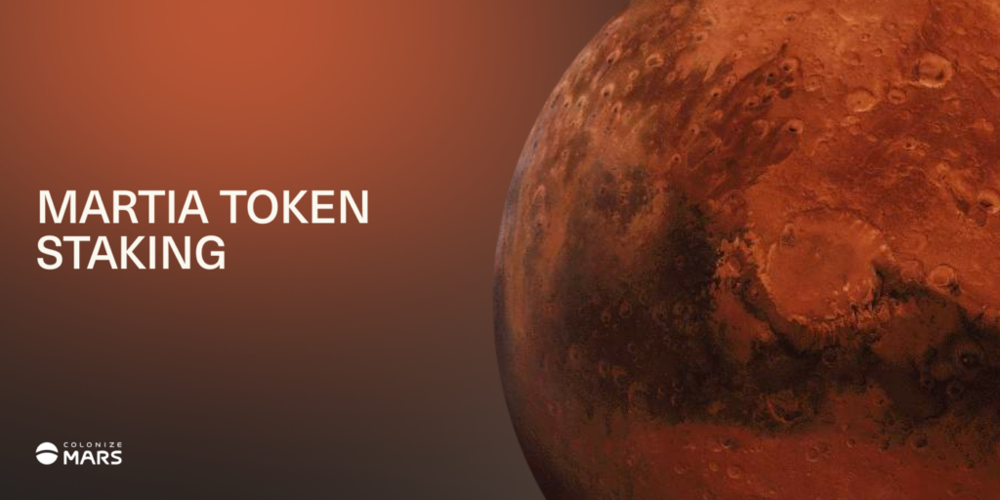

Once dominated by Ethereum and WAX, the blockchain gaming scene is rapidly expanding to other chains. Polygon, Binance Chain, Solana, and Enjin seem to have the most action, but expect to see more news from other chains this year as well as numerous cross-chain projects.

Trying to keep an eye one blockchain can be tiring enough. But now having to watch five or six!? Well we’re here to help you stay informed! Below are a few events to watch from the play to earn gaming scene in February.

## Heroes of Mavia Land Sale

Grab some land for your base so you can conquer other players and take all their loot! Heroes of Mavia has a number of different avenues to get on the [whitelist for their land sale](https://www.playtoearn.online/2022/01/11/heroes-of-mavia-land-sale-whitelist-applications-are-open/). Some of them are still open, but the window is closing quickly! Check here for the current options – https://www.mavia.com/whitelist

Heroes of Mavia runs on the Ethereum blockchain. Lands cost from 0.3 ETH for a Common, to 0.9 ETH for a Legendary. Land sale is expected in mid February. Grab a land if you plan on playing Heroes of Mavia!

## Colonize Mars Staking

Developing a colony on another planet isn’t easy. To do so, you need resources. In Colonize Mars, some of those resources include Water, Oxygen, and Power, all of which can be acquired by staking the Martia token. One staking pool even rewards NFTs! [Staking is expected to start in February](https://www.playtoearn.online/2022/01/24/staking-martia-token-in-colonize-mars/). Colonize Mars runs on the WAX blockchain. MARTIA can be purchased on Alcor Exchange.

## Dark Country Land Updates

Dark Country begins its metaverse expansion with the [first release of their land gameplay](https://www.playtoearn.online/2022/01/19/dark-country-releases-2022-roadmap/). Land owners earn Shadow Dimes, allowing them to upgrade their lands and attract players to their saloons. Active players also earn by completing quests. Dark Country runs on the WAX blockchain. Lands can be purchased from secondary sellers on Atomic Hub.

## Voxies Beta

An NFT project on the Ethereum blockchain, Voxies plans to release their Open Beta in February. Voxies are collectible NFTs, that are also playable in game. The beta features PvP action in the [Voxies Tactics](https://www.playtoearn.online/2021/08/11/nft-characters-for-voxies-tactical-rpg-sold-out/) game, a tactical, turn-based, battle game.

The beta includes a free to play option for those of us who are unfortunate enough to not own any Voxies. Players earn random rewards just for playing as well as prizes for those at the top of the leaderboard. Voxie owners have the opportunity to equip and customize their Voxies and everyone can shop at the marketplace. This could be the start of something big for the Voxies!

Expect more features to be added as the beta progresses. Keep an eye on https://www.voxies.io/blog for details on the beta opening date.

## Defi Land Seed Sale Updates

Defi Land dropped lots of details about it’s first [Gen-0 Seed sal](https://www.playtoearn.online/2022/02/01/get-ready-to-grow-seeds-on-defi-land/)e. The Seed drops open on February 8th and 9th, with each Seed costing 2 SOL. You’ll also need DFL, the Defi Land token, to water your Seed and grow it into special NFTs that provide bonuses in Defi Land minigames. If you’re at all bullish on the Solana blockchain, you’ll want to take a look a Defi Land.

## Illuvium Beta

Illuvium closed beta is planned for the end of February. This creature battler game has received a lot of hype over the past year and seen its token rise meteorically. In fact, the ILV token currently has a market cap of over 385 million! The steady stream of screenshots and videos from the team has only stoked the interest of the playerbase. It will be very exciting to see and possibly experience the actual gameplay! [Register now for you chance to be one of the first in on ](https://www.playtoearn.online/2022/01/25/register-for-a-chance-to-be-in-illuvium-beta/)the action!